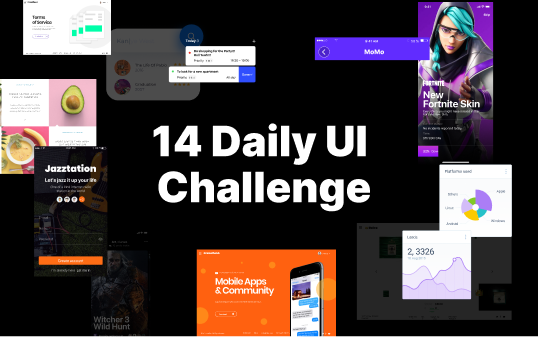

# 14 Daily UI



## Challenge

- [001 - Signup](https://github.com/dangvanthanh/14-daily-ui-challenge/issues/1) - [Figma](https://www.figma.com/file/t4ZsLTGl6tjsNWlB1oqIGC/Poeta---14-Day-Challenge?node-id=0%3A1&t=XJwC3EV3ma39rmGQ-1)
- [002 - Leaderboard](https://github.com/dangvanthanh/14-daily-ui-challenge/issues/2) - [Figma](https://www.figma.com/file/t4ZsLTGl6tjsNWlB1oqIGC/Poeta---14-Day-Challenge?node-id=2%3A2&t=XJwC3EV3ma39rmGQ-1)
- [003 - Subscribe](https://github.com/dangvanthanh/14-daily-ui-challenge/issues/3) - [Figma](https://www.figma.com/file/t4ZsLTGl6tjsNWlB1oqIGC/Poeta---14-Day-Challenge?node-id=2%3A3&t=XJwC3EV3ma39rmGQ-1)
- [004 - 404 Page](https://github.com/dangvanthanh/14-daily-ui-challenge/issues/4) - [Figma](https://www.figma.com/file/t4ZsLTGl6tjsNWlB1oqIGC/Poeta---14-Day-Challenge?node-id=2%3A4&t=XJwC3EV3ma39rmGQ-1)
- [005 - Podcast](https://github.com/dangvanthanh/14-daily-ui-challenge/issues/5) - [Figma](https://www.figma.com/file/t4ZsLTGl6tjsNWlB1oqIGC/Poeta---14-Day-Challenge?node-id=2%3A5&t=XJwC3EV3ma39rmGQ-1)
- [006 - Slider](https://github.com/dangvanthanh/14-daily-ui-challenge/issues/6) - [Figma](https://www.figma.com/file/t4ZsLTGl6tjsNWlB1oqIGC/Poeta---14-Day-Challenge?node-id=2%3A6&t=XJwC3EV3ma39rmGQ-1)
- [007 - Single Product](https://github.com/dangvanthanh/14-daily-ui-challenge/issues/7) - [Figma](https://www.figma.com/file/t4ZsLTGl6tjsNWlB1oqIGC/Poeta---14-Day-Challenge?node-id=5%3A55&t=XJwC3EV3ma39rmGQ-1)
- [008 - Weather App](https://github.com/dangvanthanh/14-daily-ui-challenge/issues/8) - [Figma](https://www.figma.com/file/t4ZsLTGl6tjsNWlB1oqIGC/Poeta---14-Day-Challenge?node-id=5%3A56&t=XJwC3EV3ma39rmGQ-1)
- [009 - Image Carousel](https://github.com/dangvanthanh/14-daily-ui-challenge/issues/9) - [Figma](https://www.figma.com/file/t4ZsLTGl6tjsNWlB1oqIGC/Poeta---14-Day-Challenge?node-id=5%3A57&t=XJwC3EV3ma39rmGQ-1)
- [010 - Verification Code](https://github.com/dangvanthanh/14-daily-ui-challenge/issues/10) - [Figma](https://www.figma.com/file/t4ZsLTGl6tjsNWlB1oqIGC/Poeta---14-Day-Challenge?node-id=5%3A58&t=XJwC3EV3ma39rmGQ-1)
- [011 - Map](https://github.com/dangvanthanh/14-daily-ui-challenge/issues/11) - [Figma](https://www.figma.com/file/t4ZsLTGl6tjsNWlB1oqIGC/Poeta---14-Day-Challenge?node-id=5%3A60&t=XJwC3EV3ma39rmGQ-1)
- [012 - Rock Paper Scissors](https://github.com/dangvanthanh/14-daily-ui-challenge/issues/12) - [Figma](https://www.figma.com/file/t4ZsLTGl6tjsNWlB1oqIGC/Poeta---14-Day-Challenge?node-id=5%3A59&t=XJwC3EV3ma39rmGQ-1)
- [013 - Upload File](https://github.com/dangvanthanh/14-daily-ui-challenge/issues/13) - [Figma](https://www.figma.com/file/t4ZsLTGl6tjsNWlB1oqIGC/Poeta---14-Day-Challenge?node-id=5%3A61&t=XJwC3EV3ma39rmGQ-1)
- [014 - Dashboard](https://github.com/dangvanthanh/14-daily-ui-challenge/issues/14) - [Figma](https://www.figma.com/file/t4ZsLTGl6tjsNWlB1oqIGC/Poeta---14-Day-Challenge?node-id=6%3A161&t=XJwC3EV3ma39rmGQ-1)

## Getting Started

1. This includes all the project assets you need to get started: HTML, CSS and JavaScript files.
2. Look at the project's Figma file. This is a great way to see how the pieces and parts should look within the browser.
3. Open the project's issue. It has additional information on how the project is structured.
4. Customize your project / file architecture to your liking.
5. Happy coding! Example, go to the folder such as `001-signup`

```
$ npm run dev
```

You can view the development live server at `http://127.0.0.1:8080`

## Taking your Project to the Next Level

- Use a library or framework like [Alpine](), [Angular](), [React](), [Vue](), [Solid](), [Svelte] or others you like. Or, if you're feeling particularly adventurous, try writing everything in Vanilla JavaScript.
- Take a step back and try writing the HTML and CSS for this project yourself. Start with the provided Figma file
- Add an animation on load, have the podcast list slide out from under the podcast artwork 